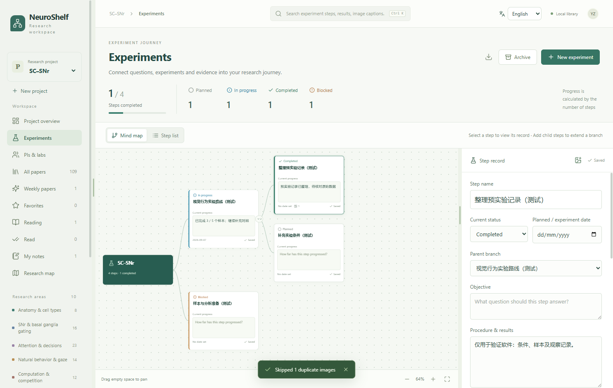
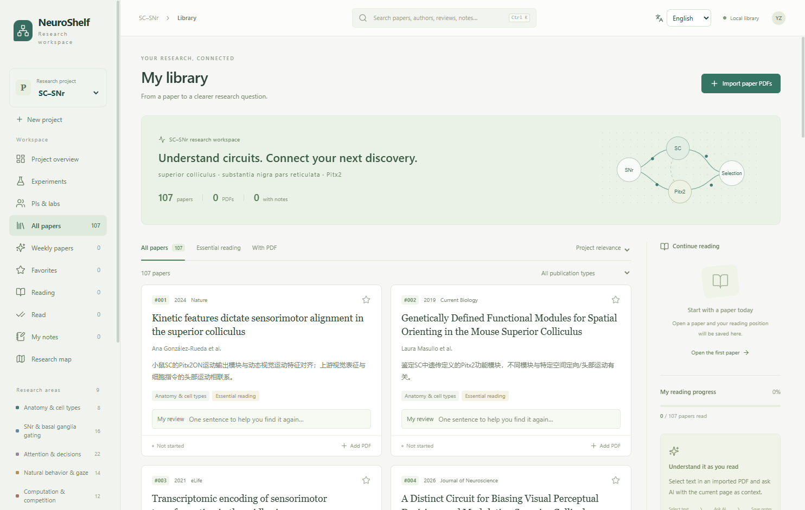

# NeuroShelf

**English** · [简体中文](README.zh-CN.md)

**Keep papers, reading notes and experiment progress in one research project.**

NeuroShelf is a Windows research workspace with English and Simplified Chinese interfaces. It grew from an SC–SNr / Pitx2 literature map into a project library, PDF reader, AI reading assistant, PI directory and experiment notebook. Create separate projects for other research questions.

[Download for Windows · 0.8.1](https://github.com/yuanxinz-666/NeuroShelf/releases/download/v0.8.1/NeuroShelf-0.8.1-Windows.exe) · [All releases](https://github.com/yuanxinz-666/NeuroShelf/releases) · [User guide](docs/USAGE.en.md) · [Report an issue](https://github.com/yuanxinz-666/NeuroShelf/issues)

## From reading to experiments

| Task | What NeuroShelf provides |
| --- | --- |
| Organize projects | A research question, keywords, paper library, candidate inbox, PIs and experiments for each project |
| Find a paper again | Tags, favorites, reading status and a searchable personal review below each paper card |
| Read PDFs | Batch import, selectable text, highlights with margin comments, notes and saved reading position |
| Ask while reading | Select PDF text and press Space; resize the AI sidebar, adjust its font size and choose GPT-6 reasoning effort |
| Discover papers | Project research and a weekly candidate inbox; review suggestions before adding them to the library |
| Explore PIs | Profiles, ten-year publication charts, keywords, CNS counts, two journal ranking systems, academic relationships and funding sources |
| Track experiments | A tree-shaped mind map and step list, status, dates, records, next actions, image evidence, archiving and restoration |
| Keep your work | Autosave, per-project backups including PDFs and evidence images, and Markdown export |
| Choose your language | English by default, a remembered Chinese/English choice and a separate AI response language |

### Experiment progress

Break a research question into experiments and substeps. Open a node to review its records and evidence images, and follow its progress from planned to in progress, completed or blocked.



### Paper library and personal reviews

Leave a short personal assessment below a paper, then search for that assessment when you need the paper again.



Screenshots use an isolated test library. The public app includes metadata and reading guides for 107 SC–SNr sample papers. Paper PDFs, personal notes and experiment data are not bundled. Original sample guides are in Chinese and can be translated on request through the AI sidebar.

## English and Chinese in the same app

The first launch defaults to **English**. Use the **English / 简体中文** menu in the top bar to change languages immediately. Your choice is saved for subsequent launches, updates and project switches under the same Windows user profile.

Under **Settings & AI → Language**, choose whether AI responses follow the interface or always use English or Simplified Chinese. For example, you can keep the interface in English and ask for explanations in Chinese.

Switching languages preserves the current page and editing drafts. Paper text, titles, existing guides, personal notes, PI records and experiments remain in their original language. **Translate guide into English** generates a translation in the AI sidebar using your configured connection and keeps the original guide intact.

## Use on Windows

1. Download `NeuroShelf-0.8.1-Windows.exe` from [Releases](https://github.com/yuanxinz-666/NeuroShelf/releases/latest), keep it in a permanent folder and double-click it.
2. Open the sample project or create your own. Import PDFs you have downloaded and link them to the corresponding papers.
3. Configure a connection in **Settings & AI** when you want AI assistance. Local reading, notes and experiment records work independently.

This is a **Windows x64 portable executable**. It extracts on launch and does not require Node.js or Python for normal use. The release is validated on Windows 11 x64.

AI connections can use the official login of a locally installed Codex, or you can copy reading context into an existing assistant manually. Model and reasoning availability depend on the capabilities and allowance returned by your connection; NeuroShelf does not supply model access. An API connection is an optional, separate configuration. See the [user guide](docs/USAGE.en.md) for setup and the context sent with a question.

The weekly inbox and project participation settings are included. **Automatic Monday runs require a scheduler configured in your own environment.** Downloading the app does not create a scheduled task.

## Run from source

Development and packaging use Windows, Node.js 24 and pnpm 11. `pnpm-lock.yaml` pins the dependency versions.

```powershell
git clone https://github.com/yuanxinz-666/NeuroShelf.git
cd NeuroShelf
pnpm install --frozen-lockfile
pnpm build
pnpm start
```

```powershell
# Unit tests
pnpm test

# Desktop workflows with an isolated library and mock AI
pnpm test:desktop

# Build release/win-unpacked/NeuroShelf.exe
pnpm package

# Build release/NeuroShelf-0.8.1-Windows.exe
pnpm dist

# Verify the portable executable
node scripts/smoke-desktop.cjs release/NeuroShelf-0.8.1-Windows.exe
```

`pnpm dev` runs the frontend preview only. Verify native file, PDF and AI integration in Electron. Source launches use the same application data location by default; set `NEUROSHELF_DATA_DIR` to a temporary directory for isolated development.

## Data and research coverage

- Libraries and imported files are stored locally. AI questions include selected text, page context, recent conversation and any images or related pages you actively attach.
- PI lists, paper searches and funding records show sources, coverage and verification dates. They are not complete field-wide or individual performance assessments.
- CNS counts refer to the main journals Cell, Nature and Science. CAS top-level category Tier 1 and JCR Q1 are selectable; import ranking data with a year and source. Unmatched records remain unknown.
- Mentorship and career destinations require source evidence. Coauthorship alone is treated as a collaboration lead.
- When automatic PDF retrieval fails, download an accessible copy in your browser and import it manually.

## Source layout

```text
src/        React library, reader, PI and experiment interfaces
electron/   Native storage, PDF handling, AI, research and desktop checks
data/       Public sample records, model configuration and UI translations
tests/      Unit tests and generated test fixtures
scripts/    Build, desktop verification and project inbox tools
docs/       English/Chinese guides, release notes and demo screenshots
```

See [Localization](docs/LOCALIZATION.md) for the translation workflow. Real project folders, PDFs, evidence images, account settings, caches and build output are excluded from the source repository. Windows binaries are distributed through GitHub Releases.

Maintainer: [yuanxinz-666](https://github.com/yuanxinz-666)
