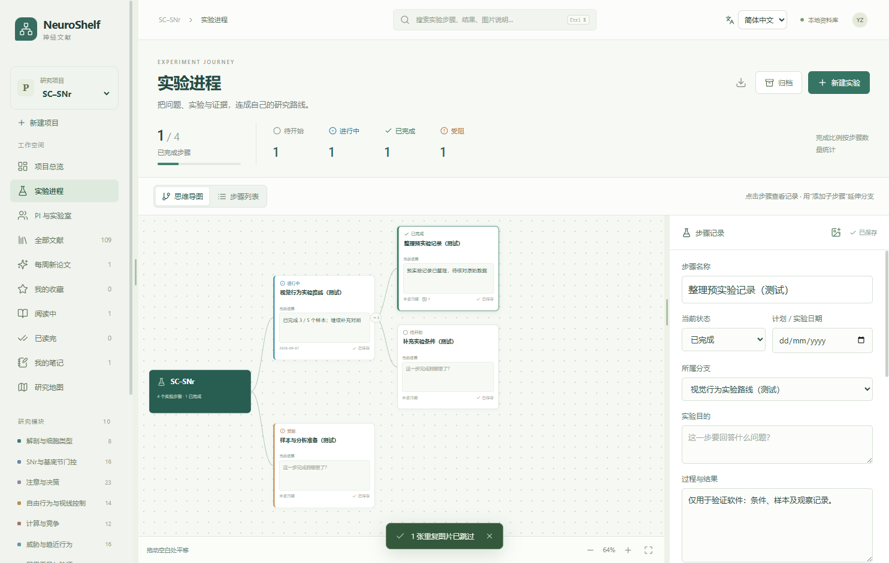
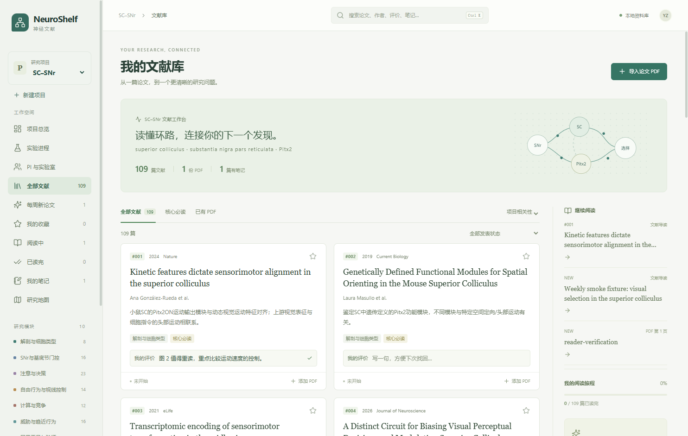

# NeuroShelf · 神经文献

[English](README.md) · **简体中文**

**把论文、理解和实验进展放进同一个研究项目。**

NeuroShelf 是一款支持英文和简体中文的 Windows 科研工作台。从 SC–SNr / Pitx2 文献地图出发，逐步扩展为项目文库、PDF 精读、AI 阅读助手、PI 档案和实验记录工具。可以为其他研究问题新建独立项目。

[下载 Windows 0.8.1](https://github.com/yuanxinz-666/NeuroShelf/releases/download/v0.8.1/NeuroShelf-0.8.1-Windows.exe) · [全部发布版本](https://github.com/yuanxinz-666/NeuroShelf/releases) · [使用说明](docs/USAGE.zh-CN.md) · [反馈问题](https://github.com/yuanxinz-666/NeuroShelf/issues)

## 从阅读到实验

| 工作 | NeuroShelf 提供的功能 |
| --- | --- |
| 管理项目 | 每个项目保存研究问题、关键词、文库、候选论文、PI 和实验进程 |
| 找回论文 | 标签、收藏、阅读状态、全文关联；论文卡片下方可写一句个人评价，并通过评价搜索 |
| 精读 PDF | 批量导入、可选择文字的阅读器、高亮旁注、笔记、阅读位置保存 |
| 随手问 AI | 选中 PDF 原文后按空格提问；可调整侧栏宽度与字号；GPT-6 推理强度切换 |
| 发现新论文 | 项目调研和每周候选收件箱，先审核再加入正式文库 |
| 了解 PI | 详细介绍、近十年发表图表、关键词、CNS、两种一区口径、学术关系和资助来源 |
| 跟踪实验 | 树形思维导图与步骤列表，状态、日期、记录、下一步、图片证据、归档恢复 |
| 保存积累 | 自动保存；按项目导出完整文库备份，包含 PDF 和实验图片；导出 Markdown |
| 选择语言 | 默认英文，随时切换简体中文并记住选择；AI 回答语言可独立设置 |

## 中英文使用

首次打开 0.8.1 时默认为英文。顶部的 **English / 简体中文** 菜单可立即切换，选择会自动保存，重启、升级或切换项目后继续沿用。在 **Settings & AI → Language** 中可以单独设置 AI 回答语言，默认跟随界面。

界面切换不会翻译或覆盖论文标题、导读、个人评价、笔记、PI 资料和实验记录。已有示例导读保留中文；文献导读页的 **Translate guide into English / 翻译导读为英文** 会通过当前 AI 连接生成英文译文，显示在侧栏中，保留原文。

### 实验进程

把研究问题拆成实验和子步骤，点击节点查看记录与证据图片。完成、进行中、待开始和受阻状态汇总到项目中。



### 文库与个人评价

在卡片底部留下一句自己的判断，下次可以直接搜索到。



截图来自隔离测试文库，含模拟条目与记录。公开版本内置 107 篇 SC–SNr 示例文献的元数据和导读，不附带论文 PDF、个人笔记或实验数据。

## 在 Windows 上使用

1. 从 [Releases](https://github.com/yuanxinz-666/NeuroShelf/releases/latest) 下载 `NeuroShelf-0.8.1-Windows.exe`，放到一个固定文件夹后双击打开。
2. 打开示例项目，或通过侧栏新建项目。将自己下载的 PDF 导入并关联到对应论文。
3. 在“设置与 AI 连接”中选择连接方式；本地阅读、笔记和实验记录可以独立使用。

这是 **Windows x64 免安装单文件版**，首次启动需要解包。普通使用无需安装 Node.js 或 Python。发布验证环境为 Windows 11 x64；本次不提供 iPad、macOS 或远程连接版本。

AI 连接支持调用本机 Codex 的官方登录，或手动复制阅读上下文到已有助手。模型与推理档位能否使用取决于连接账号实际返回的能力和额度；软件本身不提供模型账号或额度。API 连接是独立选项。详细连接步骤和数据发送范围见[使用说明](docs/USAGE.zh-CN.md)。

每周候选收件箱和项目开关包含在软件中，**每周一自动执行的调度任务需要在使用者自己的环境另外配置**。下载程序不会自动创建定时任务。

## 从源码运行

开发与打包使用 Windows、Node.js 24 和 pnpm 11。依赖版本由 `pnpm-lock.yaml` 固定。

```powershell
git clone https://github.com/yuanxinz-666/NeuroShelf.git
cd NeuroShelf
pnpm install --frozen-lockfile
pnpm build
pnpm start
```

```powershell
# 单元测试
pnpm test

# 桌面流程检查：使用隔离测试文库与模拟 AI，不请求真实模型
pnpm test:desktop

# 生成 release/win-unpacked/NeuroShelf.exe
pnpm package

# 生成 release/NeuroShelf-0.8.1-Windows.exe
pnpm dist

# 检查生成的单文件包
node scripts/smoke-desktop.cjs release/NeuroShelf-0.8.1-Windows.exe
```

`pnpm dev` 仅启动前端开发服务器；完整的本地文件、PDF 和 AI 能力请通过 Electron 桌面程序验证。源码运行默认使用同名应用的数据目录；调试时可先设置 `NEUROSHELF_DATA_DIR` 指向临时目录。

## 数据与统计说明

- 文库和导入文件保存在本机。向 AI 提问时，会发送所选原文、当前页上下文、近期对话及主动附加的图片或相关页。
- PI 名单、论文检索和公开资助资料均有覆盖范围与核对日期，不表示完整领域覆盖或完整个人业绩。
- CNS 仅统计 Cell、Nature、Science 本刊。中科院大类一区与 JCR Q1 可切换，需用户导入有年份和来源的分区数据；未知记录保留为未知。
- 学术师承与人员去向需要来源证据，共同署名本身只作为合作线索。
- 自动下载失败时，可在有权限的浏览器中下载 PDF 后手动导入。

## 目录

```text
src/        React 阅读、文库、PI 和实验界面
electron/   本地存储、PDF、AI 连接、调研与桌面流程
data/       公共示例文献、PI 种子与模型配置
tests/      单元测试与生成式测试素材
scripts/    构建、桌面验证、项目收件箱工具
docs/       使用说明、版本说明与演示截图
```

真实项目目录、PDF、实验图片、账号设置、缓存和构建产物均不进入源码仓库。桌面下载包通过 GitHub Releases 分发。

维护者：[yuanxinz-666](https://github.com/yuanxinz-666)
